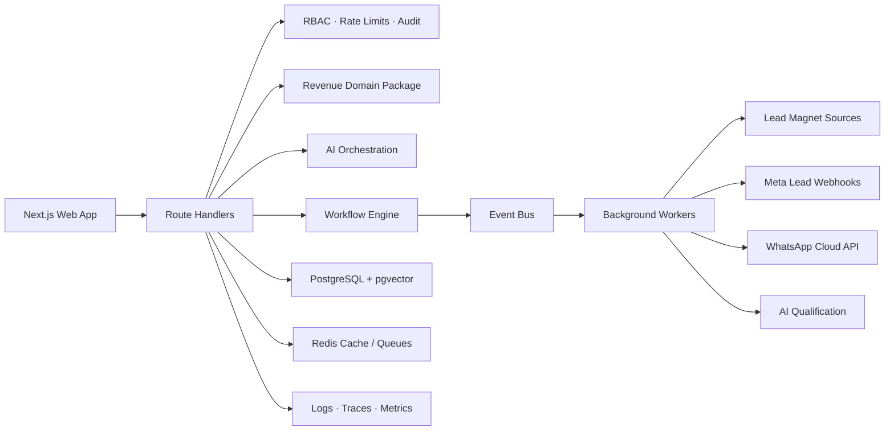

# Architecture

Leadsy is an AI Lead Intelligence & Operations Platform rather than a Revenue OS or CRM-first product. The current product priority is Indian SMB and agency lead intelligence: research prospects, build durable lead knowledge, generate human-operator tasks, draft outreach for approval, and support qualification work without autonomous sends.

## System Shape

## Design Decisions

- Next.js App Router keeps the product shell, server-rendered data views, and route handlers close while still allowing package-level separation.
- PostgreSQL with pgvector is the default database for multitenant agency clients, Meta leads, WhatsApp conversations, CRM records, audit logs, embeddings, and analytics-ready facts.
- Redis is the intended cache, queue, and rate-limit backend. The current package uses in-memory primitives for local development with compatible interfaces.
- AI logic lives behind the existing model abstraction, so deterministic local responses can be replaced by OpenAI, Anthropic, Vercel AI Gateway, OpenRouter, or a private model router.
- Workflow definitions are typed DAG-like objects with Meta triggers, normalization, AI qualification, WhatsApp messaging, routing, and booking nodes.
- Every mutation-facing route calls RBAC, rate limiting, audit logging, and structured spans.
- The Lead Magnet layer separates research/scoring from messaging. AI can discover, enrich, score, summarize, and draft at high volume, while automated outreach requires an approved source or consent context.

## Tenant Model

Every revenue object carries a `tenantId`. Production storage should enforce this with:

- compound unique indexes including `tenantId`
- row-level security where supported
- tenant-aware repository functions
- audit log writes on sensitive reads and all mutations

## AI Plane

The AI plane should support the lead-intelligence mission hierarchy:

- Research agents: prospect research, public evidence collection, enrichment, and fit signals
- Knowledge agents: lead summaries, buying-signal detection, duplicate reasoning, and account briefs
- Task agents: proposed next actions for human operators, with approval before execution
- Drafting agents: outreach drafts and follow-up planning that require human approval before any send
- Lead Magnet agents: OpenRouter free public web search/fetch, free directory research, public social profile research, contact-page extraction, review/reputation checks, content-gap analysis, hiring/news signals, competitor context, fit scoring, evidence checks, first-touch drafting, and follow-up planning
- Analytics agents: secondary reporting, anomaly detection, and cohort interpretation

The local implementation is deterministic so the app runs without secrets. Production providers plug into the same interface.

## Event Flow

Example: prospect discovery to booked site visit.

1. Agency owner saves a lead brief with service, target customer, location, lead goal, and exclusions
2. Discovery source emits `leadmagnet.discovery.completed` or Meta webhook emits `meta.lead.ingested`
3. Normalizer dedupes the prospect, preserves evidence URLs, and keeps missing contact fields empty
4. AI scores fit, urgency, evidence quality, contactability, buying intent, and spam risk
5. Approved prospects are drafted for WhatsApp/DM/email review; unknown-consent prospects stay manual
6. WhatsApp reply engine qualifies budget, location, timeline, and appointment intent
7. Hot buyers are escalated or booked, while softer leads enter AI nurture
8. Analytics records source cost, response SLA, qualification, booking, and conversion facts
